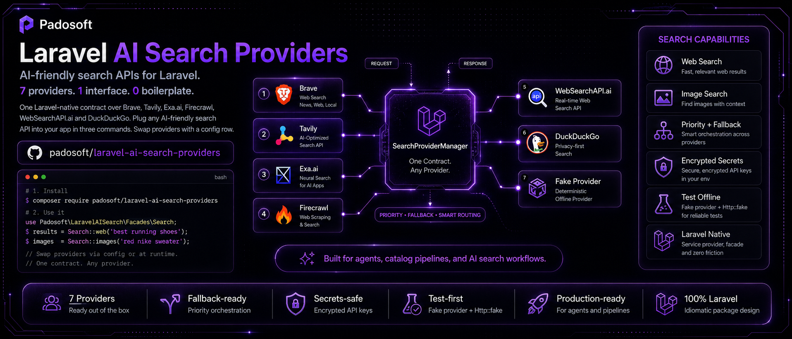
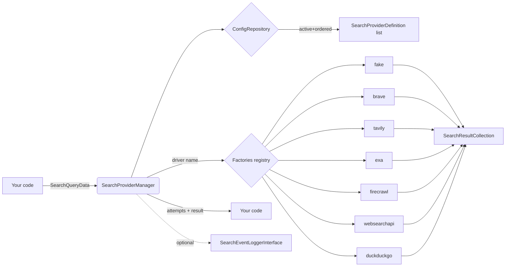

# Laravel AI Search Providers

[](https://packagist.org/packages/padosoft/laravel-ai-search-providers)
[](https://packagist.org/packages/padosoft/laravel-ai-search-providers)
[](https://www.php.net/)
[](https://laravel.com/)
[](LICENSE)
[](https://github.com/padosoft/laravel-ai-search-providers/actions/workflows/ci.yml)



**One Laravel-native contract over Brave, Tavily, Exa.ai, Firecrawl, WebSearchAPI.ai, DuckDuckGo, SearchAPI.io and You.com.** Plug any AI-friendly search API into your app in three commands. Swap providers with a config row. Test offline with the bundled fake provider, then go live with `Http::fake`-driven unit tests and an opt-in real-API E2E suite.

> 9 providers. 1 interface. 0 boilerplate.

## Table of Contents

- [Why this package](#why-this-package)
- [Features](#features)
- [Supported providers](#supported-providers)
- [Quick Start (5 minutes, junior-friendly)](#quick-start-5-minutes-junior-friendly)
- [Per-provider setup](#per-provider-setup)
  - [Brave Search](#brave-search)
  - [Tavily](#tavily)
  - [Exa.ai](#exaai)
  - [Firecrawl](#firecrawl)
  - [WebSearchAPI.ai](#websearchapiai)
  - [DuckDuckGo (HTML lite)](#duckduckgo-html-lite)
  - [Fake provider](#fake-provider)
- [Architecture](#architecture)
- [Configuration reference](#configuration-reference)
- [Extending: add a custom driver](#extending-add-a-custom-driver)
- [Testing](#testing)
- [Backward compatibility tips for host apps](#backward-compatibility-tips-for-host-apps)
- [Roadmap](#roadmap)
- [Contributing](#contributing)
- [Credits](#credits)
- [License](#license)

## Why this package

Modern AI agents and product/catalog/price-comparison tooling all need the same primitive: **search the web, parse the results, hand them to the next stage**. Every API does it differently — Brave returns one shape, Tavily another, Exa flattens images inside `extras`, Firecrawl uses `data.images[]`, DuckDuckGo has no API at all. Re-implementing that plumbing in every Laravel project is repetitive, brittle, and impossible to test offline.

This package gives you:

1. **One interface** (`SearchProviderInterface`) — `searchImages()` and `searchWeb()`, period.
2. **One manager** (`SearchProviderManager`) — picks the right provider by priority, falls back when one fails, logs every attempt, never leaks API keys.
3. **One config row** — drop a row in `search_providers`, set `is_active=true`, you're done. Switch providers from staging to production with a SQL update.

It's the search/extraction backbone the [`padosoft/product-image-discovery`](https://github.com/padosoft/product-image-discovery) catalog pipeline runs in production, extracted and hardened for everyone else.

## Features

- 🔌 **9 providers out of the box** — Brave, Tavily, Exa.ai, Firecrawl, WebSearchAPI.ai, DuckDuckGo (no key), SearchAPI.io, You.com, and a deterministic Fake for tests.
- 🧪 **Test-first** — every driver is unit-tested via `Http::fake`. Live E2E suite is opt-in and self-skips when API keys are absent.
- 🛡️ **Secrets-safe by default** — `api_key` / `api_secret` are encrypted at rest, redacted from logs and execution metadata, never exposed in `toSafeArray()`.
- 🔄 **Priority + fallback orchestration** — list multiple providers, set priority, the manager tries them in order and falls back on failure or empty results.
- 🧱 **Pluggable model + table** — the package ships `search_providers` table; host apps can override via one config key without subclassing.
- 🪶 **Zero-config Quick Start** — `composer require` + `migrate` + activate the fake provider = working pipeline in 5 minutes, no API keys.
- 📦 **Laravel-native** — auto-discovery, publishable config + migrations, `loadMigrationsFrom` so junior devs don't have to copy files.
- 🤖 **Built for agents** — `SearchEventLoggerInterface` lets you stream every provider attempt into your own audit/observability layer.
- 🦆 **Free fallback included** — DuckDuckGo HTML lite parser ships with the package; no key, anti-bot–aware live test self-skips in CI.
- 🇮🇹 **EU-friendly** — Apache-2.0 license, runs on Laravel 11/12/13 with PHP 8.3+, no proprietary lock-in.

## Supported providers

Out of the box the package ships **9 search providers** ready to plug in:

| Provider | Driver | Image search | Site filter | Free tier | Docs |
|---|---|:-:|:-:|---|---|
| Fake (deterministic) | `fake` | ✅ | ✅ | — | bundled |
| Brave Search | `brave` | ✅ | ✅ | 2 000 queries / month | <https://api-dashboard.search.brave.com/app/documentation> |
| Tavily | `tavily` | ✅ | ✅ (`include_domains`) | 1 000 credits / month | <https://docs.tavily.com> |
| Exa.ai | `exa` | ✅ (`extras.imageLinks`) | ✅ (`includeDomains`) | trial credits | <https://exa.ai/docs> |
| Firecrawl | `firecrawl` | ✅ (`sources:[{type:"images"}]`) | ✅ (`includeDomains`) | 500 credits / month | <https://docs.firecrawl.dev> |
| WebSearchAPI.ai | `websearchapi` | ❌ (web-only) | ✅ (`includeDomains`) | trial credits | <https://websearchapi.ai/docs/search-api> |
| DuckDuckGo (HTML lite) | `duckduckgo` | ❌ (web-only) | ✅ (`site:`) | no key | <https://duckduckgo.com/html/> |
| SearchAPI.io | `searchapi` | ✅ (`engine=google_images`) | ✅ (`site:`) | trial credits | <https://www.searchapi.io/docs/google-images> |
| You.com | `youcom` | ❌ (web-only) | ✅ (`include_domains`) | trial credits | <https://you.com/docs/api-reference/search/v1-search> |

`SearchProviderManager` automatically skips drivers whose `supportsImageSearch()` returns `false` when you call `searchImages()`, so mixing image-capable and web-only drivers in the same priority list is safe.

## Quick Start (5 minutes, junior-friendly)

> **Prerequisites**: PHP 8.3+, Composer, a Laravel 11/12/13 app, ~5 minutes. **No API keys, no Redis, no queue worker**.

The Quick Start uses the bundled `fake` driver. You write zero code beyond the snippets below.

### 1. Install the package

```bash
composer require padosoft/laravel-ai-search-providers
```

### 2. (Optional) Publish config + migrations

The package's service provider auto-loads the migration, so this is only needed if you want to **customize** the schema or config defaults.

```bash
php artisan vendor:publish --tag=ai-search-providers-config
php artisan vendor:publish --tag=ai-search-providers-migrations
```

### 3. Run migrations

```bash
php artisan migrate
```

You now have a `search_providers` table.

### 4. Insert a fake provider row

In `php artisan tinker`:

```php
\Padosoft\LaravelAiSearchProviders\Models\SearchProviderConfig::query()->create([
    'code' => 'quickstart-fake',
    'name' => 'Quickstart Fake',
    'driver' => 'fake',
    'config' => [
        'image_results' => [[
            'title' => 'Quick Start Demo',
            'page_url' => 'https://example.test/p/demo',
            'image_url' => 'https://cdn.example.test/demo.jpg',
            'source_domain' => 'example.test',
            'width' => 1200,
            'height' => 1200,
        ]],
    ],
    'priority' => 1,
    'timeout_seconds' => 5,
    'is_active' => true,
]);
```

### 5. Run a search

Anywhere in your app (controller, console command, tinker):

```php
use Padosoft\LaravelAiSearchProviders\Data\SearchQueryData;
use Padosoft\LaravelAiSearchProviders\SearchProviderManager;

$manager = app(SearchProviderManager::class);

$execution = $manager->searchImages(SearchQueryData::fromArray([
    'brand' => 'Nike',
    'model' => 'Air Force 1 07',
    'color' => 'White',
    'site' => 'nike.com',
    'limit' => 5,
]));

dump($execution->provider?->code);          // "quickstart-fake"
dump($execution->results->count());         // 1
dump($execution->results->first()->title);  // "Quick Start Demo"
```

✅ **Done.** You just plugged in your first AI search provider. Now swap the row's `driver` to `tavily`/`brave`/`exa`/`firecrawl`/`websearchapi`/`duckduckgo`, paste the API key into `api_key_encrypted`, and the same code runs live. See [Per-provider setup](#per-provider-setup) for each driver's env vars.

## Per-provider setup

Every live driver shares the same activation flow:

1. Set the API key in `.env`.
2. Insert a `SearchProviderConfig` row (tinker snippet below).
3. The next `SearchProviderManager::searchImages()` / `::searchWeb()` call uses it.

Below are the driver-specific details.

### Brave Search

```env
BRAVE_SEARCH_API_KEY=your-key
```

```php
\Padosoft\LaravelAiSearchProviders\Models\SearchProviderConfig::query()->create([
    'code' => 'brave',
    'name' => 'Brave Search',
    'driver' => 'brave',
    'base_url' => 'https://api.search.brave.com',
    'api_key_encrypted' => env('BRAVE_SEARCH_API_KEY'),
    'priority' => 10,
    'timeout_seconds' => 15,
    'is_active' => true,
]);
```

### Tavily

```env
TAVILY_API_KEY=your-key
```

```php
\Padosoft\LaravelAiSearchProviders\Models\SearchProviderConfig::query()->create([
    'code' => 'tavily',
    'name' => 'Tavily',
    'driver' => 'tavily',
    'base_url' => 'https://api.tavily.com',
    'api_key_encrypted' => env('TAVILY_API_KEY'),
    'config' => ['search_depth' => 'basic'],
    'priority' => 20,
    'timeout_seconds' => 20,
    'is_active' => true,
]);
```

Tavily returns `images[]` either as a `string[]` (legacy) or as `{url, description?}[]` (current); the driver normalizes both.

### Exa.ai

```env
EXA_API_KEY=your-key
```

```php
\Padosoft\LaravelAiSearchProviders\Models\SearchProviderConfig::query()->create([
    'code' => 'exa',
    'name' => 'Exa.ai',
    'driver' => 'exa',
    'base_url' => 'https://api.exa.ai',
    'api_key_encrypted' => env('EXA_API_KEY'),
    'config' => ['search_type' => 'auto', 'image_links_per_result' => 5],
    'priority' => 30,
    'timeout_seconds' => 20,
    'is_active' => true,
]);
```

Each Exa result can carry up to `image_links_per_result` images in `extras.imageLinks`. The driver flattens them 1:N and emits one candidate per image URL, deduped against the primary `image`.

### Firecrawl

```env
FIRECRAWL_API_KEY=your-key
```

```php
\Padosoft\LaravelAiSearchProviders\Models\SearchProviderConfig::query()->create([
    'code' => 'firecrawl',
    'name' => 'Firecrawl',
    'driver' => 'firecrawl',
    'base_url' => 'https://api.firecrawl.dev',
    'api_key_encrypted' => env('FIRECRAWL_API_KEY'),
    'priority' => 40,
    'timeout_seconds' => 60,       // /v2/search is synchronous; 20–40 s typical on free tier
    'rate_limit_per_minute' => 30,
    'is_active' => true,
]);
```

### WebSearchAPI.ai

```env
WEBSEARCHAPI_API_KEY=your-key
```

```php
\Padosoft\LaravelAiSearchProviders\Models\SearchProviderConfig::query()->create([
    'code' => 'websearchapi',
    'name' => 'WebSearchAPI.ai',
    'driver' => 'websearchapi',
    'base_url' => 'https://api.websearchapi.ai',
    'api_key_encrypted' => env('WEBSEARCHAPI_API_KEY'),
    'priority' => 50,
    'timeout_seconds' => 30,
    'is_active' => true,
]);
```

WebSearchAPI exposes only Google-backed organic web results, so the driver reports `supportsImageSearch() === false` and the manager skips it for image queries automatically. Use it as a primary web driver or as a fallback.

### DuckDuckGo (HTML lite)

No key required. The driver POSTs to `https://html.duckduckgo.com/html/`, parses the response with `DOMDocument` + `DOMXPath`, and decodes the `//duckduckgo.com/l/?uddg=...` redirect links transparently.

```env
# Optional override (defaults to https://html.duckduckgo.com):
DUCKDUCKGO_URL=https://html.duckduckgo.com
```

```php
\Padosoft\LaravelAiSearchProviders\Models\SearchProviderConfig::query()->create([
    'code' => 'duckduckgo',
    'name' => 'DuckDuckGo (HTML lite)',
    'driver' => 'duckduckgo',
    'base_url' => 'https://html.duckduckgo.com',
    'priority' => 60,
    'timeout_seconds' => 20,
    'rate_limit_per_minute' => 20,   // be polite, shared anti-bot infra
    'is_active' => true,
]);
```

**Caveats:**
- Web search only (`supportsImageSearch() === false`).
- DuckDuckGo applies anti-bot rate limits to shared/datacenter IPs. Use sparingly. The bundled live test self-skips in CI (`CI=true`) and on 403/429/503 responses.

### SearchAPI.io

Single `GET /api/v1/search` endpoint with an `engine` switch: `google_images` for image search (response `images[]` with `original.link`, `original.{width,height}`, `thumbnail`, `source.link`, `source.name`), `google` for web search (response `organic_results[]` with `link`, `title`, `snippet`, `source`, `thumbnail`). Auth via `Authorization: Bearer`. Site filter appended as `site:<host>` operator to the query.

```env
SEARCHAPI_API_KEY=your-key
SEARCHAPI_URL=https://www.searchapi.io
```

Activate:

```php
\Padosoft\LaravelAiSearchProviders\Models\SearchProviderConfig::query()->create([
    'code' => 'searchapi',
    'name' => 'SearchAPI.io',
    'driver' => 'searchapi',
    'base_url' => 'https://www.searchapi.io',
    'api_key_encrypted' => env('SEARCHAPI_API_KEY'),
    'config' => ['country' => 'us', 'language' => 'en'],
    'priority' => 90,
    'timeout_seconds' => 30,
    'is_active' => true,
]);
```

### You.com

`GET /v1/search` against `https://ydc-index.io` with `X-API-Key` header. Response shape: `results.web[]` (and optionally `results.news[]`) with `title`, `url`, `description`, `snippets[]`, `thumbnail_url`, `page_age`, `favicon_url`. Site filter propagated as `include_domains` (comma-separated). **Web-only** as of 2026-05: You.com does not expose a dedicated image-search endpoint, so `supportsImageSearch()` returns `false` and the manager skips this driver for image queries automatically; `thumbnail_url` is still surfaced per-result for downstream consumers.

```env
YOUCOM_API_KEY=your-key
YOUCOM_URL=https://ydc-index.io
```

Activate:

```php
\Padosoft\LaravelAiSearchProviders\Models\SearchProviderConfig::query()->create([
    'code' => 'youcom',
    'name' => 'You.com',
    'driver' => 'youcom',
    'base_url' => 'https://ydc-index.io',
    'api_key_encrypted' => env('YOUCOM_API_KEY'),
    'config' => ['country' => 'US', 'safesearch' => 'moderate'],
    'priority' => 100,
    'timeout_seconds' => 30,
    'is_active' => true,
]);
```

### Fake provider

Deterministic, no network. Configure via the `config` JSON column:

```php
\Padosoft\LaravelAiSearchProviders\Models\SearchProviderConfig::query()->create([
    'code' => 'tests',
    'name' => 'Fake (tests)',
    'driver' => 'fake',
    'config' => [
        'image_results' => [/* array of result rows */],
        'web_results'   => [/* array of result rows */],
        'throw'         => false,       // set true to simulate failure
        'throw_for'     => ['web'],     // or fail just one method
        'supports_image_search' => true,
        'supports_site_filter'  => true,
    ],
    'priority' => 1,
    'is_active' => true,
]);
```

Perfect for feature tests, smoke tests, and the [Quick Start](#quick-start-5-minutes-junior-friendly).

## Architecture



Core moving pieces:

- **`SearchProviderManager`** — orchestrates a search call. Reads active providers from the repository, sorts by priority, tries each driver via its factory, falls back on failure, skips when a driver doesn't support the requested method, returns a `SearchProviderExecutionResult` with the full attempt log.
- **`SearchProviderConfigRepositoryInterface`** — pluggable backing store. Default `EloquentSearchProviderConfigRepository` reads rows from the `search_providers` table; you can swap it for an in-memory implementation in tests or a Redis/etcd-backed one in production.
- **`SearchProviderFactoryInterface` + `CallableSearchProviderFactory`** — closure-based factory pattern. Register your own driver by appending to `config('ai-search-providers.factories')`.
- **`AbstractHttpSearchProvider`** — base class providing the shared HTTP / parsing helpers (`pickUrl`, `dotGet`, `extractDomain`, `normalizeDomain`, `normalizeInt`, `normalizeFloat`, `applySiteFilter`). New drivers add ~80 LOC of provider-specific code.
- **`SearchEventLoggerInterface`** — single hook (`record($eventType, $context, $level)`). Bind your audit logger and you'll get one event per provider attempt: success, failure, empty result, skipped.

## Configuration reference

`config/ai-search-providers.php` (after `vendor:publish`):

| Key | Type | Default | Purpose |
|---|---|---|---|
| `table` | string | `search_providers` (or `env('AI_SEARCH_PROVIDERS_TABLE')`) | Eloquent table name read by `SearchProviderConfig::getTable()` and the create-table migration. |
| `model` | class-string\|null | `null` | When set, `EloquentSearchProviderConfigRepository` uses this class instead of the bundled `SearchProviderConfig`. Useful for host apps that want a thin subclass with extra columns or a custom table. |
| `load_migrations` | bool | `true` | Toggle `loadMigrationsFrom()` in the service provider. Disable when you fully manage the schema yourself. |
| `factories` | array<string, callable\|class-string\|`SearchProviderFactoryInterface`> | `[]` | Per-driver factory overrides, merged on top of the 7 bundled defaults. |

Plus the per-provider env vars listed under [Per-provider setup](#per-provider-setup).

## Extending: add a custom driver

```php
namespace App\Search;

use Padosoft\LaravelAiSearchProviders\Data\SearchQueryData;
use Padosoft\LaravelAiSearchProviders\Data\SearchResultCollection;
use Padosoft\LaravelAiSearchProviders\Providers\AbstractHttpSearchProvider;

final class SerperSearchProvider extends AbstractHttpSearchProvider
{
    public function searchImages(SearchQueryData $query): SearchResultCollection
    {
        $this->assertHttpClientAvailable();

        $payload = \Illuminate\Support\Facades\Http::baseUrl($this->definition->baseUrl ?? 'https://google.serper.dev')
            ->withHeaders(['X-API-KEY' => (string) $this->definition->apiKey])
            ->timeout($this->definition->timeoutSeconds)
            ->post('/images', ['q' => $this->applySiteFilter($query), 'num' => $query->limit])
            ->throw()
            ->json();

        return new SearchResultCollection(array_map(fn (array $hit): array => [
            'title' => $hit['title'] ?? 'Untitled',
            'page_url' => $hit['link'] ?? null,
            'image_url' => $hit['imageUrl'] ?? null,
            'thumbnail_url' => $hit['thumbnailUrl'] ?? null,
            'source_domain' => $this->extractDomain($hit['link'] ?? null),
        ], $payload['images'] ?? []));
    }

    public function searchWeb(SearchQueryData $query): SearchResultCollection
    {
        return new SearchResultCollection();
    }
}
```

Register it in `config/ai-search-providers.php`:

```php
'factories' => [
    'serper' => static fn ($definition) => new \App\Search\SerperSearchProvider($definition),
],
```

Insert a `SearchProviderConfig` row with `driver = 'serper'` and your code is now reachable from `SearchProviderManager`. Done.

## Testing

The package ships a full unit suite that does not touch the network:

```bash
vendor/bin/phpunit --testsuite Unit,Feature
```

The optional E2E suite under `tests/E2E/` exercises every live driver against real APIs:

```bash
# Put your keys in .env first (see .env.example)
vendor/bin/phpunit --testsuite E2E
```

Without keys the live tests **skip cleanly**, so CI stays green even in PRs from contributors without credentials. The DuckDuckGo live test additionally skips on `CI=true` (shared runner IPs are anti-bot-throttled).

In your own app's tests, use the bundled fake provider (see [Fake provider](#fake-provider)) or the test-helper repository `Padosoft\LaravelAiSearchProviders\Tests\Support\InMemorySearchProviderConfigRepository` to inject definitions without touching the database.

## Backward compatibility tips for host apps

If you're extracting your own search layer onto this package (the way `padosoft/product-image-discovery` does):

- **Keep your existing table**: set `config('ai-search-providers.table')` to your legacy table name (e.g. `product_image_search_providers`). The bundled migration is `Schema::hasTable()`-guarded so it skips automatically.
- **Keep your existing model**: extend `SearchProviderConfig` with a thin subclass, hard-code `protected $table = '...'`, and set `config('ai-search-providers.model')` to the FQCN. All your downstream `Foo::with('searchProvider')` calls keep working.
- **Wire your audit logger**: bind your existing event logger to `SearchEventLoggerInterface` in your service provider, and the manager emits one event per attempt into your audit trail.

## Roadmap

- 🔁 Runtime enforcement of `rate_limit_per_minute` (currently advisory).
- 🧠 Built-in caching adapter (decorator over any driver).
- 🧬 Perceptual-hash dedupe utility for image results.
- 🪙 More drivers as the community asks: Serper.dev, Bing Web Search, Kagi.
- 🧭 Optional **Vertex AI Search / Agent Search** adapter, shipped as a separate sub-package (e.g. `padosoft/laravel-ai-search-providers-google-vertex`) so consumers that need it pull in the heavier `google/cloud-discoveryengine` SDK only when actually using it. Google Custom Search JSON API was intentionally skipped — it was closed to new customers in 2026 and new Programmable Search Engines can no longer index the full web ([context](https://support.google.com/programmable-search/answer/12397162)).
- 🎨 Refresh the community banner asset (`resources/laravel-ai-search-providers-banner.png`) to show 9 providers — the current artwork was generated at the v1.0.0 cut and still reads "7 providers".

See `docs/PROGRESS.md` for in-flight work and `docs/LESSON.md` for design notes accumulated during the original extraction.

## Contributing

Pull requests welcome. Before opening one:

1. Run `vendor/bin/phpunit --testsuite Unit,Feature` locally and make sure it stays green.
2. If you touched HTTP plumbing, drive it with `Http::fake` — don't add network-bound unit tests.
3. New providers: ship the driver, ≥4 unit-test cases (parse OK, empty payload, HTTP 4xx, peculiarity), and an opt-in live E2E test under `tests/E2E/`.
4. Update README's [Supported providers](#supported-providers) matrix.

## Credits

- [Lorenzo Padovani](https://github.com/padosoft) — author and maintainer.
- The drivers were originally engineered inside [`padosoft/product-image-discovery`](https://github.com/padosoft/product-image-discovery) v0.2.0 → v0.3.0 and extracted here as v1.0.0.
- Big thanks to Brave, Tavily, Exa.ai, Firecrawl, WebSearchAPI.ai and DuckDuckGo for the APIs this package wraps.

## License

Apache-2.0. See [LICENSE](LICENSE).
