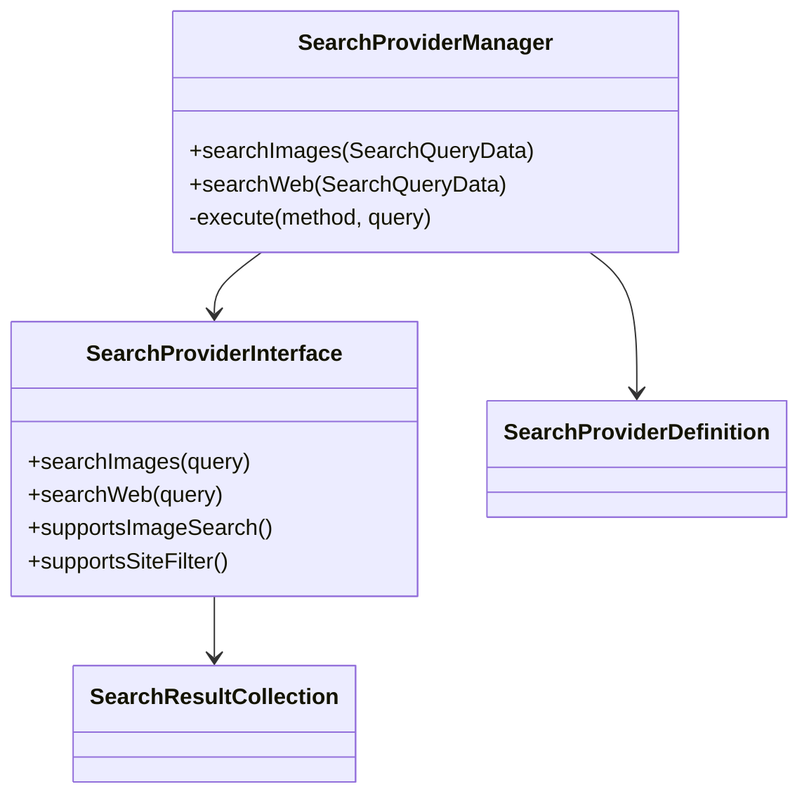

# Design

The design keeps provider differences behind narrow driver classes and keeps Laravel application code pointed at the manager.

::: callout tip "Boundary rule"
Application code should not parse Brave, Tavily, Exa, or Firecrawl payloads directly. Put provider-specific parsing in a driver and return normalized results.
:::

