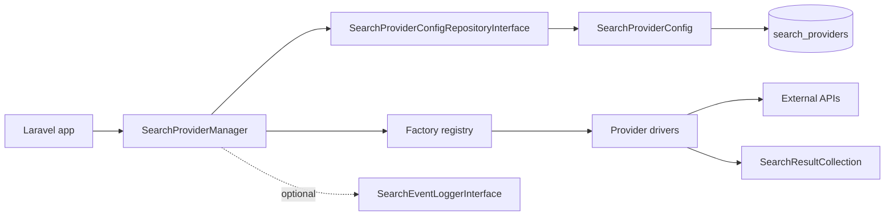

# Architecture Overview

## Components

| Component | Responsibility |
|---|---|
| `SearchProviderManager` | Orchestration, fallback, skip/failure accounting. |
| `SearchProviderConfigRepositoryInterface` | Supplies active runtime definitions. |
| `CallableSearchProviderFactory` | Wraps closures into factory instances. |
| Provider classes | Translate provider-specific APIs into normalized results. |
| Data objects | Stable query, definition, result, and execution contracts. |

