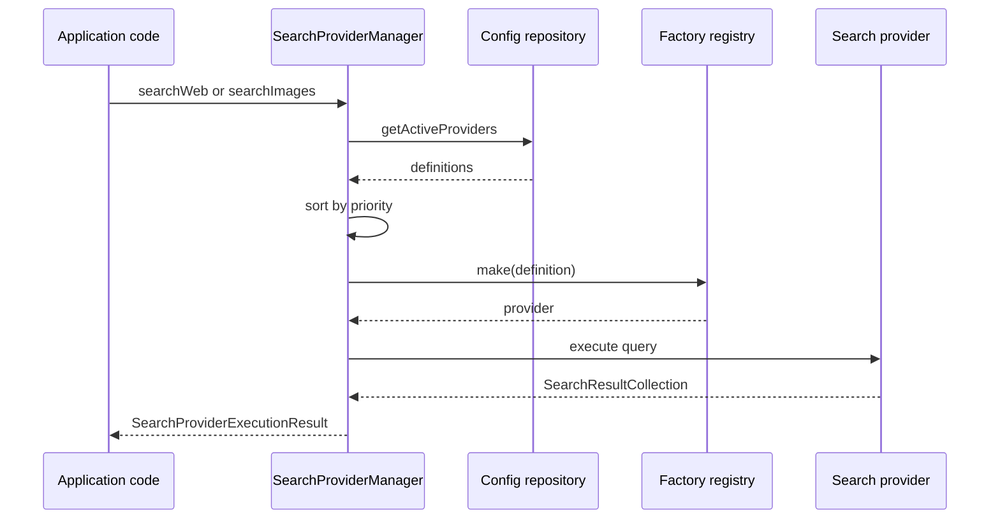

# Pipeline Workflow

::: callout warning "No built-in runtime rate limiter"
`rate_limit_per_minute` is stored and exposed as metadata, but runtime enforcement is currently advisory. Add a decorator factory if the host app must hard-enforce quotas.
:::

