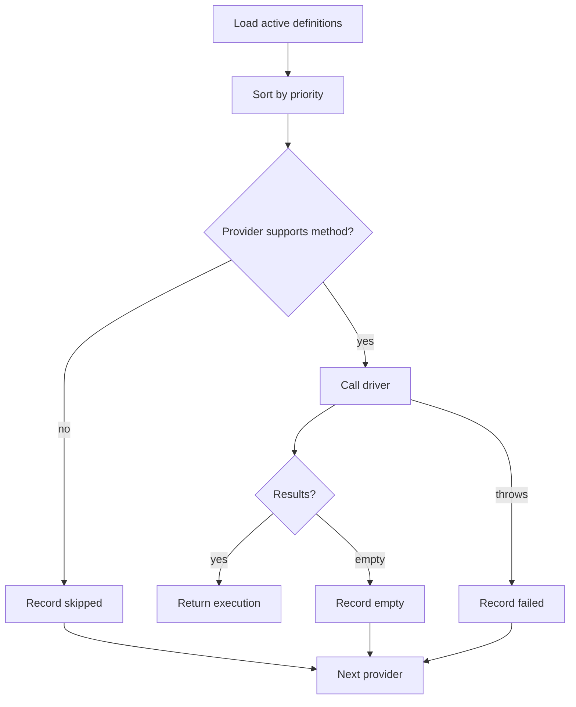

# Ranking & Fallback

The manager sorts active providers by ascending `priority`, then tries each provider in order.

::: callout info "Attempt logs are part of the return value"
Use `attempts` for debugging and audit trails. Bind `SearchEventLoggerInterface` when you need central observability.
:::

