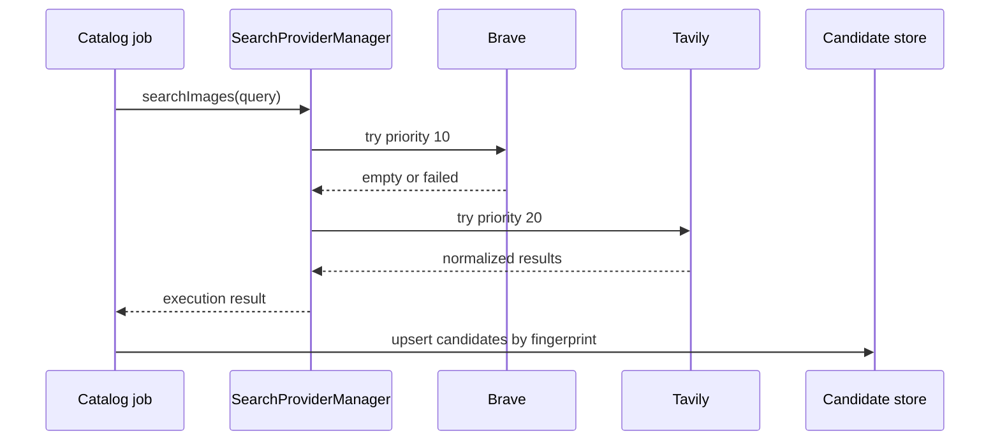

# Worked Example

This example searches for product images with two live providers and one free fallback.

::: steps
1. **Create provider rows**

   Configure `brave` at priority `10`, `tavily` at `20`, and `duckduckgo` at `90`.

2. **Prepare the query**

   ```php
   $query = SearchQueryData::fromArray([
       'brand' => $product->brand,
       'model' => $product->model,
       'color' => $product->color,
       'ean' => $product->ean,
       'site' => $product->brand_domain,
       'limit' => 10,
       'metadata' => ['product_id' => $product->id],
   ]);
   ```

3. **Execute image search**

   ```php
   $execution = app(SearchProviderManager::class)->searchImages($query);
   ```

4. **Persist audit context**

   Store `$execution->attempts`, `$execution->usedFallback`, and each result fingerprint.
:::



