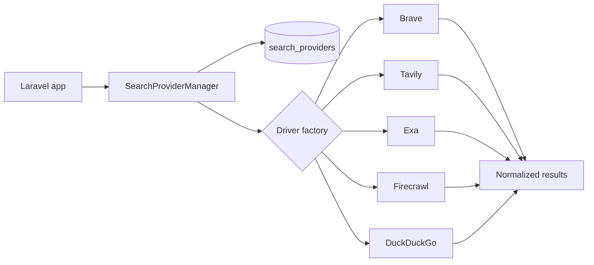

# laravel-ai-search-providers

One Laravel-native contract over Brave, Tavily, Exa.ai, Firecrawl, WebSearchAPI.ai, DuckDuckGo, SearchAPI.io, You.com, and a deterministic fake provider.

::: callout tip "Use the docs when integrating the package"
The package is designed for Laravel 11, 12, and 13 applications on PHP 8.3 or newer. Start with the fake provider, then activate live providers by inserting rows in `search_providers`.
:::

::: grids
::: grid
::: card "One contract" icon:plug
Call `searchImages()` or `searchWeb()` through `SearchProviderManager` and receive a normalized `SearchProviderExecutionResult`.
:::
:::
::: grid
::: card "Fallback orchestration" icon:route
Providers are loaded from the database, sorted by `priority`, skipped when unsupported, and tried until one returns results.
:::
:::
::: grid
::: card "Secrets-safe defaults" icon:lock
`api_key_encrypted` and `api_secret_encrypted` are encrypted casts and never appear in `toSafeArray()` output.
:::
:::
:::

## When to use it

Use this package when your app needs a swappable search/extraction backbone for AI agents, catalog enrichment, product image discovery, price comparison, RAG source gathering, or provider experimentation.

## Package facts

| Item | Value |
|---|---|
| Composer package | `padosoft/laravel-ai-search-providers` |
| Namespace | `Padosoft\LaravelAiSearchProviders` |
| License | Apache-2.0 |
| Maintainer | Lorenzo Padovani, Padosoft |
| Repository | `https://github.com/padosoft/laravel-ai-search-providers` |

