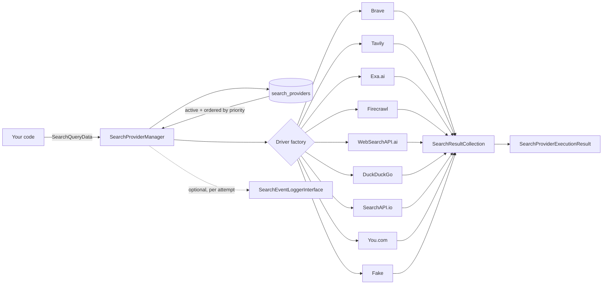

# laravel-ai-search-providers


[](https://packagist.org/packages/padosoft/laravel-ai-search-providers)
[](https://packagist.org/packages/padosoft/laravel-ai-search-providers)


> **laravel-ai-search-providers gives your AI app one Laravel-native search contract over every web & image search API worth using.**
> Call `searchImages()` or `searchWeb()` once and get normalized results from Brave, Tavily, Exa.ai,
> Firecrawl, WebSearchAPI.ai, DuckDuckGo, SearchAPI.io or You.com — with priority + fallback
> orchestration, secrets encrypted at rest, and a deterministic fake provider so your tests never
> touch the network. Self-hosted, EU-friendly, zero per-provider plumbing.

::: callout info "New here? Read this page top to bottom" icon:compass
In five minutes you'll know exactly what this package is, the problem it solves, why it beats every
"just call the API yourself" alternative, and where to click next. Every other page goes deeper — this
one gives you the whole picture.
:::

---

## What it is — in one minute

Every AI agent, RAG pipeline, catalog enricher and price-comparison tool needs the same primitive:
**search the web, parse the results, hand them to the next stage**. But every API does it differently —
Brave returns one shape, Tavily another, Exa flattens images inside `extras`, Firecrawl uses
`data.images[]`, DuckDuckGo has no API at all. Re-implementing that plumbing in every Laravel project
is repetitive, brittle, and impossible to test offline.

`laravel-ai-search-providers` collapses all of it behind **one interface**:

- **One contract** — `searchImages()` and `searchWeb()` on `SearchProviderInterface`, period. Every
  driver normalizes its provider's quirky payload into the same `SearchResultCollection`.
- **One manager** — `SearchProviderManager` reads active providers from the database, sorts by
  priority, tries each in order, falls back on failure or empty results, skips drivers that can't do
  the requested method, and logs every attempt.
- **One config row** — drop a row in `search_providers`, set `is_active = true`, you're live. Swap
  staging → production with a single SQL update; no code change.

> **In one line:** *the search/extraction backbone for AI on Laravel — 9 providers, 1 interface, 0 boilerplate, fully testable offline.*

---

## The problem it solves

Wiring web search into an AI app means fighting eight different API shapes, key handling and failure
modes by hand. Here is the gap this package closes.

| Without laravel-ai-search-providers | With laravel-ai-search-providers |
|---|---|
| Each API returns a different JSON shape — you hand-map Brave, Tavily, Exa, Firecrawl… one by one. | **One `SearchResultCollection`** — every driver normalizes its provider's payload to the same shape. |
| Switching providers means rewriting calling code and redeploying. | **Switch with a config row** — change `driver` (or `is_active`) in `search_providers`; the same code runs live. |
| One provider rate-limits or 500s and your feature goes dark. | **Priority + fallback orchestration** — the manager tries providers in order and falls back automatically. |
| API keys leak into logs, dumps and error metadata. | **Secrets-safe by default** — keys encrypted at rest, redacted from logs, never in `toSafeArray()`. |
| Tests hit live APIs — flaky, slow, costly, blocked in CI. | **Deterministic fake provider** + `Http::fake`-driven unit tests; live E2E suite is opt-in and self-skips without keys. |
| Mixing image-capable and web-only providers needs manual guards. | The manager **auto-skips** drivers whose `supportsImageSearch()` is `false` for image queries. |
| Adding a new provider means another bespoke client class. | **`AbstractHttpSearchProvider`** ships the shared HTTP/parse helpers — a new driver is ~80 LOC. |

---

## Who it's for

::: grids
  ::: grid
    ::: card "AI agent & RAG builders" icon:bot
    Need fresh web sources for retrieval or tool-use? Get normalized results from any provider through one call — and swap engines without touching agent code.
    :::
  :::
  ::: grid
    ::: card "Catalog & price-intelligence teams" icon:shopping-cart
    The exact backbone `padosoft/product-image-discovery` runs in production for image discovery, catalog enrichment and competitor monitoring.
    :::
  :::
  ::: grid
    ::: card "Scrapers & data engineers" icon:database
    Image search, web search and site-filtering across eight APIs behind one interface — with a free DuckDuckGo fallback that needs no key.
    :::
  :::
  ::: grid
    ::: card "Teams that test seriously" icon:test-tube
    The deterministic fake provider and in-memory repository let you assert on results with zero network — CI stays green even without API keys.
    :::
  :::
:::

---

## Why it's different — the moats

Most projects glue one search SDK to one feature and call it done. This package is the
provider-agnostic layer that makes search a swappable, testable, governed dependency.

::: grids
  ::: grid
    ::: card "One interface, every provider" icon:plug
    `searchImages()` / `searchWeb()` over Brave, Tavily, Exa.ai, Firecrawl, WebSearchAPI.ai, DuckDuckGo, SearchAPI.io and You.com — no per-provider client code in your app.
    :::
  :::
  ::: grid
    ::: card "9 drivers out of the box" icon:layers
    Eight live providers plus a deterministic fake, each unit-tested via `Http::fake`. Free DuckDuckGo HTML-lite parser ships in the box — no key required.
    :::
  :::
  ::: grid
    ::: card "Priority + fallback orchestration" icon:route
    List several providers, set a priority, and the manager tries them in order, falls back on failure or empty results, and skips unsupported methods automatically.
    :::
  :::
  ::: grid
    ::: card "Normalization you can trust" icon:shapes
    Every quirky payload — Exa's `extras.imageLinks`, Firecrawl's `data.images[]`, Tavily's legacy vs current `images[]` — is flattened into one `SearchResultCollection`.
    :::
  :::
  ::: grid
    ::: card "Deterministic fake for tests" icon:flask-conical
    A `fake` driver returns scripted results, simulates failures per-method, and toggles capabilities — so feature tests are fast, offline and reproducible.
    :::
  :::
  ::: grid
    ::: card "Secrets-safe by design" icon:lock
    `api_key` / `api_secret` are encrypted at rest, redacted from logs and execution metadata, and never exposed by `toSafeArray()`.
    :::
  :::
  ::: grid
    ::: card "Pluggable everything" icon:puzzle
    Swap the config store (`SearchProviderConfigRepositoryInterface`), register custom drivers via the factory map, override table & model — all without subclassing the core.
    :::
  :::
  ::: grid
    ::: card "Built for observability" icon:activity
    Bind `SearchEventLoggerInterface` and get one event per attempt — success, failure, empty, skipped — streamed straight into your own audit/observability layer.
    :::
  :::
  ::: grid
    ::: card "Laravel-native & EU-friendly" icon:shield-check
    Auto-discovery, publishable config + migrations, `loadMigrationsFrom`, Apache-2.0, Laravel 11/12/13 on PHP 8.3+ — no proprietary lock-in.
    :::
  :::
:::

---

## laravel-ai-search-providers vs. the alternatives

| Capability | **laravel-ai-search-providers** | Per-provider SDKs | Hand-rolled HTTP | LangChain-style tools |
|---|:---:|:---:|:---:|:---:|
| One normalized contract over 8+ search APIs | ✅ | ❌ | ➖ | ➖ |
| Swap providers with a config row (no code change) | ✅ | ❌ | ❌ | ➖ |
| Built-in priority + fallback orchestration | ✅ | ❌ | ➖ | ➖ |
| Deterministic fake provider for offline tests | ✅ | ❌ | ❌ | ❌ |
| Secrets encrypted at rest + redacted from logs | ✅ | ➖ | ❌ | ➖ |
| Free, no-key fallback (DuckDuckGo) included | ✅ | ❌ | ➖ | ➖ |
| Native Laravel (auto-discovery, migrations, Eloquent) | ✅ | ➖ | ➖ | ❌ |
| Self-hosted in **your** Laravel DB, you own the data | ✅ | ✅ | ✅ | ➖ |

> Legend: ✅ built-in · ➖ partial / extra work / not first-class · ❌ not available.

---

## How it fits together

Your code passes a `SearchQueryData`; the manager loads active providers, picks each driver via its
factory, normalizes results and falls back on failure — emitting one event per attempt.



---

## Start in 30 seconds

::: steps
1. **Install the package**
   ```bash
   composer require padosoft/laravel-ai-search-providers
   php artisan migrate
   ```
   The service provider auto-loads the migration, so you get a `search_providers` table with no extra
   wiring. Publishing config/migrations is optional — only if you want to customize the schema.

2. **Activate a provider (start with the zero-key fake)**
   ```php
   use Padosoft\LaravelAiSearchProviders\Models\SearchProviderConfig;

   SearchProviderConfig::query()->create([
       'code' => 'quickstart-fake',
       'name' => 'Quickstart Fake',
       'driver' => 'fake',
       'config' => ['image_results' => [[
           'title' => 'Quick Start Demo',
           'page_url' => 'https://example.test/p/demo',
           'image_url' => 'https://cdn.example.test/demo.jpg',
           'source_domain' => 'example.test',
       ]]],
       'priority' => 1,
       'is_active' => true,
   ]);
   ```

3. **Run a search**
   ```php
   use Padosoft\LaravelAiSearchProviders\Data\SearchQueryData;
   use Padosoft\LaravelAiSearchProviders\SearchProviderManager;

   $execution = app(SearchProviderManager::class)->searchImages(
       SearchQueryData::fromArray(['brand' => 'Nike', 'model' => 'Air Force 1 07', 'limit' => 5]),
   );

   $execution->results->first()->title; // "Quick Start Demo"
   ```
   Swap the row's `driver` to `tavily` / `brave` / `exa` / `firecrawl` / `searchapi` / `youcom`, paste
   the API key, and the **same code** runs live.
:::

**[→ Full Quickstart](/get-started/quickstart)** · **[→ Installation](/get-started/installation)** · **[→ Worked Example](/guides/worked-example)**

---

## Batteries included for AI-assisted development

This repo ships **AI batteries** — an invocable `.claude/skills/docmd-docs` skill plus `.claude/rules`
encoding the docs-sync discipline (Markdown-only, nav-complete, `npm run check` + `npm run build`
before commit). Open the package in Claude Code, Cursor, Copilot or Codex and your agent already knows
the house rules for keeping this docs site honest.

---

## Where to go next

::: grids
  ::: grid
    ::: card "Quickstart" icon:zap
    Install, activate the fake provider and run your first search in minutes. **[Open →](/get-started/quickstart)**
    :::
  :::
  ::: grid
    ::: card "Provider Setup" icon:plug
    Per-provider env vars and activation rows for Brave, Tavily, Exa, Firecrawl and the rest. **[Read →](/guides/provider-setup)**
    :::
  :::
  ::: grid
    ::: card "Architecture" icon:boxes
    The manager pipeline, the driver contract, the data model and the ADRs behind the design. **[Explore →](/architecture/overview)**
    :::
  :::
:::

::: callout tip "Package facts" icon:info
Composer `padosoft/laravel-ai-search-providers` · Namespace `Padosoft\LaravelAiSearchProviders` ·
PHP `^8.3` · Laravel `11 || 12 || 13` · Apache-2.0 ·
[GitHub](https://github.com/padosoft/laravel-ai-search-providers) ·
[Packagist](https://packagist.org/packages/padosoft/laravel-ai-search-providers)
:::
